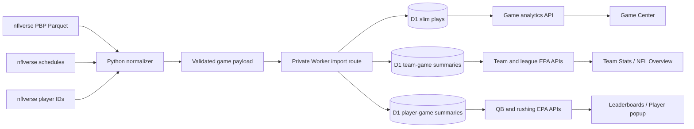

# Fixtura NFL and College Football Product and EPA Implementation Plan

## Purpose and status

This is the implementation plan for the next Fixtura NFL and college-football
work. It is written for an engineer picking up the repository without relying on
chat history. It joins the NFL Overview product direction, new professional and
college expected-points-added (EPA) data tracks, and the operational work required
to support them safely.

This document is a plan, not a deployment record. As of 2026-09-09, no NFL or CFB EPA
migration, importer, route, scheduled workflow, backfill, or frontend surface has
been implemented or authorized for production. The current `main` branch is clean
and aligned with `origin/main` at `5dfc989` when this plan was started. Re-check
that state before implementation.

The recommended product direction is:

1. Make NFL Overview a concise league pulse rather than a second Scores,
   Standings, or News page.
2. Add postgame EPA from nflverse, with explicit source and freshness labels.
3. Preserve slim play-level records and materialize bounded game-level summaries.
4. Introduce EPA first in Game Center, then team pages, then NFL Overview, and
   finally selected player views.
5. Treat live EPA as out of scope. Fixtura's existing ESPN win probability remains
   the live game metric.
6. Roll the same product capability into ongoing college football, using a
   separate CFB data/model contract and ESPN identity space rather than pretending
   NFL and college metrics are interchangeable.

## Current baseline

The following capabilities are already implemented and should be extended rather
than replaced:

- NFL is a top-level, user-configurable view with Overview, Standings, and News.
- Overview currently contains only the collapsible league-leader component.
- Scores owns game cards and Game Center. Standings owns full AFC/NFC and division
  tables. News owns the complete NFL story feed.
- NFL team pages have full schedules, rosters, Stats, injuries, and team-filtered
  news.
- The Worker captures finalized ESPN player game statistics into D1, exposes
  coverage and game-log reads, and calculates total and qualified rate rankings.
- The Worker records weekly ESPN leaderboard snapshots for movement over time.
- ESPN supplies live win probability in Game Center but does not supply EPA.
- College football already exists as `ncaaf` in Scores, Live Now, the ticker,
  Calendar, Teams search/favorites, generic team schedules/rosters, and Pick'em
  league configuration. It does not have a top-level dashboard or a team Stats
  tab, and the NFL-only Worker stats routes do not cover it.
- Frontend code is static native ES modules with no build step. Offline ingestion
  tooling may use Python; this does not change the frontend architecture.

Read `AGENTS.md`, the latest dated sections of `DECISIONS.md`, and the opening
status plus newest dated section of `HANDOFF-REDESIGN.md` before implementing.

## Product principles

### NFL Overview has one job

The Overview should answer, within one short scan: what is happening now, what is
next, who is leading, and what has materially changed. Detailed exploration stays
in the existing destination pages.

The Overview should not render a complete weekly schedule, full standings tables,
all leader categories, or the full news feed. It should use concise previews with
clear actions that open Scores, Standings, News, Game Center, team pages, or the
existing player popup.

### EPA is postgame analysis

EPA and win probability answer different questions. EPA measures the change in
expected points attributable to a play from the possession team's perspective.
Win probability measures the change in the likelihood of winning. Fixtura should
continue using ESPN win probability during games and introduce nflverse EPA only
after games are processed.

The UI must identify EPA as nflverse/nflfastR-derived and postgame. It must never
present a delayed EPA value as live, blend ESPN and nflverse values into one
unlabeled series, or call win probability EPA.

### Store numerators and denominators

Season rates must be recomputed from their underlying game or play totals. Never
average game-level EPA/play, success rate, or any other percentage. This follows
the same rule already used by Fixtura's qualified player rate rankings.

### Preserve provenance and corrections

Every EPA import needs the source URL, source version or HTTP metadata when
available, normalized content hash, parser version, first-import time, most recent
import time, and coverage state. Re-imports must be idempotent and correction-aware.
Thursday data should be allowed to replace an earlier postgame import when
nflverse incorporates league stat corrections.

## EPA source decision

### Recommended source: nflverse processed play-by-play

Use the processed nflverse play-by-play Parquet release as the canonical EPA
source. nflverse documents that processed play-by-play is refreshed nightly after
game days and at additional points during game days. Raw game data is usually
available within about 15 minutes of a final, but the processed Thursday refresh
is described as the cleanest version because NFL corrections are generally folded
in by then.[^1]

The dataset directly defines `ep` as expected points before the play and `epa` as
expected points added by the possession team. It also contains the fields needed
for a controlled first implementation: game and play IDs, drive, possession and
defense teams, down and distance, yard line, play type, pass/rush flags, success,
player IDs, `qb_epa`, and play description.[^2]

The nflverse schedule dataset contains an ESPN game identifier alongside the
nflverse game identifier. That creates a provider-supported join to Fixtura's
existing ESPN event IDs; do not match games by date and team names.[^3]

The nflverse data repository is published under CC BY 4.0. Fixtura must retain
reasonable attribution, link to the source and license, and indicate that it
stores derived/filtered data.[^4]

### Sources not selected for the first implementation

- ESPN remains the source for scores, live plays, live win probability, game
  identity in the app, and existing box-score stats. It is not an EPA source.
- Do not build an EPA model inside Fixtura. Using nflfastR's published output is
  materially smaller and avoids owning model training, calibration, and versioning.
- Do not begin with a paid convenience API. A paid service can be reconsidered if
  nflverse latency or reliability proves inadequate after a real-season trial.
- Do not use raw nflverse game JSON for the first release. It is faster after a
  final but would require Fixtura to run the nflfastR parsing/model pipeline. The
  processed data is the appropriate correctness baseline.

### College football source decision

Use SportsDataverse/cfbfastR's **ESPN-derived** college-football play-by-play as
the preferred CFB source. Do not use nflverse for college football; it is an NFL
dataset and its model is not a college model.

The preferred compiled dataset is the `espn_cfb_pbp` release rather than the
legacy `cfbfastR_cfb_pbp` release. The ESPN-derived version uses ESPN game, team,
and athlete IDs directly, includes the cfbfastR EPA/WPA model output, and publishes
plain per-season Parquet assets. The documented play schema includes `EP_start`,
`EP_end`, `EPA`, `def_EPA`, scrimmage/pass/rush EPA, success indicators, drive
fields, and player participants.[^6]

SportsDataverse describes the college pipeline as a game-day process: ESPN raw
data is captured, enriched, rectangularized, and published to versioned release
assets. Each release also carries timestamp metadata that can be used for a
freshness gate.[^7]

There is a current-season availability caveat. On 2026-09-09, the public
`espn_cfb_pbp` release page listed compiled season files through 2025, while its
automation section showed active 2026-aware daily workflows. Do not assume a 2026
Parquet exists until the importer probes the exact asset and timestamp.[^8]

If the compiled 2026 season asset is missing or stale, use one of these explicit
paths after a Phase C0 comparison:

1. Preferred fallback: SportsDataverse's per-game enriched final JSON, keyed by
   the ESPN event ID. The producer documents those files as containing EPA/WPA,
   QBR, advanced box score, participants, and roster data.[^9]
2. Processing fallback: run `cfbfastR::espn_cfb_pbp_v2(game_id, epa_wpa = TRUE)`
   in the offline workflow. The function pulls ESPN core-v2 play-by-play and runs
   cfbfastR's college EP/WP models.[^10]
3. Provider alternative: CollegeFootballData's authenticated `/plays` endpoint
   exposes per-play `ppa`, but PPA is that provider's metric and must not be mixed
   into a cfbfastR EPA series without a deliberate migration and visible label.[^11]

Do not implement automatic source switching. Phase C0 must select one canonical
2026 source based on observed availability, schema, model version, and equality or
documented differences across two games. A changed source is a data-version event,
not an invisible fallback.

The SportsDataverse code repositories use permissive software licenses, but the
selected data is derived from ESPN. Before public release, verify the applicable
release/data terms and settle the exact attribution copy. The UI should at minimum
name SportsDataverse/cfbfastR and ESPN as the upstream data source without implying
endorsement.[^12]

## Recommended EPA granularity

The recommended storage level is a hybrid: a slim row per qualifying play plus
materialized team-game and player-game aggregates.

### Why retain plays

Game-only totals would support simple rankings but would make later drive charts,
largest-play explanations, early-down splits, and audit work impossible without
re-downloading and reprocessing the season. A slim play table keeps those options
open without storing the full hundreds-column source dataset.

One NFL season is on the order of tens of thousands of plays, which is reasonable
for indexed D1 storage when the schema is narrow. D1 currently permits unlimited
rows subject to database size, with a 500 MB database limit on the free plan and
10 GB on Workers Paid. D1 charges reads by rows scanned, so indexes and materialized
aggregates are necessary even when raw row count is manageable.[^5]

### Why materialize summaries

League and team leader pages should not scan every play on every request. Store
two team rows per game and a bounded set of player rows per game. Public APIs can
then aggregate roughly hundreds of rows for a season instead of tens of thousands.

### Initial supported metrics

Team offense:

- Total EPA
- EPA per qualifying offensive play
- Pass EPA and EPA per dropback
- Rush EPA and EPA per designed rush
- Success rate
- Qualifying play, dropback, and designed-rush counts

Team defense:

- Defensive EPA, defined as the negative of opponent offensive EPA so higher is
  better
- Defensive EPA allowed per play
- Pass-defense EPA and rush-defense EPA using the same sign convention
- Opponent success rate allowed
- Qualifying play counts

Quarterbacks:

- Total QB EPA using nflverse `qb_epa`
- QB EPA per dropback
- Dropbacks
- Success rate on dropbacks
- Game and season splits

Runners:

- Total rush EPA on designed rushes
- Rush EPA per designed rush
- Designed rush attempts
- Rush success rate

Receivers:

- Defer a headline receiver EPA ranking in the first release. A play's EPA belongs
  to the possession team and is not a clean measure of receiver responsibility.
- A later feature may expose **target EPA** and air/YAC components, labeled as play
  context rather than player value. Do not label it simply “receiver EPA.”

Defensive players:

- Defer individual defensive EPA. Team EPA cannot be safely assigned to the
  tackler, interceptor, or nearest named defender. This would require a separate
  attribution method and participation data; nflverse states that current-season
  participation data is not available during the season.[^1]

### Version-one qualifying-play contract

The importer should implement one documented predicate and test it against real
archived games:

- `epa` is finite.
- `play == 1`.
- possession and defense teams are present.
- the play is classified as pass or rush by nflverse.
- QB kneels, QB spikes, aborted plays, and deleted plays are excluded.
- Pass includes sacks and scrambles, following nflverse's `pass` definition.
- Rush means designed runs and excludes scrambles, following nflverse's `rush`
  definition.[^2]

Accepted-penalty plays may remain when nflverse classifies them as a normal pass
or rush and supplies EPA. Before locking this rule, compare Fixtura's resulting
team and player-week totals with nflverse's published team/player summary data for
at least two complete weeks. Record any differences rather than adding silent
fallbacks.

Do not add a garbage-time filter in version one. Report unfiltered EPA and preserve
the fields needed for a later, separately named “competitive situations” split.

## Data architecture



### Offline importer

Add an offline Python tool under `worker/scripts/epa/`. It may use DuckDB or
PyArrow to read Parquet and emit small JSON payloads; this does not add a runtime
dependency to the frontend or Worker.

Responsibilities:

1. Download the selected season's processed PBP, schedules, and player-ID data.
2. Filter to requested season, game type, and games.
3. Join nflverse game IDs to ESPN event IDs through the schedule's `espn` field.
4. Join GSIS player IDs to ESPN athlete IDs through nflverse's player dataset.
5. Apply the versioned qualifying-play predicate.
6. Build one deterministic payload per game, sorted by stable keys.
7. Calculate materialized team and player summaries from those normalized plays.
8. Calculate a content hash after normalization.
9. Reject duplicate play keys, unknown teams, non-final/missing game mappings,
   non-finite values, or inconsistent home/away identities.
10. Produce a coverage report before writing anything.

Never match player identity by display name. Preserve the GSIS ID even when no
ESPN athlete mapping exists. A missing ESPN ID should limit player-popup linking,
not discard otherwise valid team EPA.

### Scheduled execution

The Cloudflare Worker should not download and parse a season-size Parquet file.
Use a GitHub Actions workflow or an equivalent offline runner to execute the
Python normalizer and send bounded game payloads to the Worker.

Recommended schedule:

- Run daily during the NFL season after nflverse's documented nightly processing.
- Include a Thursday run that deliberately rechecks the current and previous NFL
  week for corrections.
- Support `workflow_dispatch` with season, game ID, week, and dry-run inputs.
- Skip unchanged games by comparing normalized hashes.
- Fail the workflow when final ESPN games remain unmapped or when upstream
  freshness is older than an agreed threshold.
- Retain a small coverage artifact and importer logs; never log secrets or full
  authentication headers.

Use a dedicated `EPA_IMPORT_TOKEN` stored as a Wrangler secret and a GitHub Actions
secret. It should authorize only the EPA import route. Do not reuse a user session,
Google OAuth secret, or broad Cloudflare account token.

### Proposed D1 migration

Create a new additive migration, provisionally
`worker/migrations/0003_nfl_epa.sql`. The final names may change during the local
spike, but the responsibilities should remain separate.

`nfl_epa_games`

- `event_id TEXT PRIMARY KEY` — ESPN event ID
- `nflverse_game_id TEXT NOT NULL UNIQUE`
- `season INTEGER NOT NULL`
- `season_type INTEGER NOT NULL`
- `week INTEGER NOT NULL`
- `home_team TEXT NOT NULL`, `away_team TEXT NOT NULL`
- `source_url TEXT NOT NULL`
- `source_version TEXT`, `source_updated_at TEXT`
- `source_hash TEXT NOT NULL`
- `parser_version INTEGER NOT NULL`
- `first_imported_at INTEGER NOT NULL`, `imported_at INTEGER NOT NULL`
- `coverage TEXT NOT NULL` — `complete` or `partial`
- `warnings_json TEXT NOT NULL`

`nfl_epa_plays`

- Composite primary key: `(event_id, play_id)`
- `drive`, `quarter`, `clock`, `down`, `yards_to_go`, `yardline_100`
- `possession_team`, `defense_team`, `play_type`, `description`
- `ep_before`, `epa`, `success`
- `is_pass`, `is_rush`, `is_dropback`
- `passer_gsis_id`, `rusher_gsis_id`, `receiver_gsis_id`
- `qb_epa`
- Foreign key to `nfl_epa_games` with cascade delete

Index plays by `(event_id, drive, play_id)`, `(season support should come through
the game table)`, possession team via a deliberate denormalization only if query
plans prove the join inadequate, and player IDs only when an actual read route
needs them.

`nfl_epa_team_games`

- Composite primary key: `(event_id, team)`
- Opponent and home/away role
- Offensive and defensive EPA totals
- Offensive and defensive qualifying play counts
- Pass/dropback EPA and counts
- Rush EPA and counts
- Success counts and allowed-success counts
- Foreign key to `nfl_epa_games`

`nfl_epa_player_games`

- Composite primary key: `(event_id, gsis_id, role)`
- `espn_athlete_id`, team, display name
- Role constrained initially to `qb` or `rusher`
- EPA numerator, opportunity denominator, successful-play numerator
- Foreign key to `nfl_epa_games`

`nfl_epa_import_state`

- One row per attempted game import, including games that fail validation
- Discovery, attempt, success, status, retry count, and bounded error text
- Mirrors the useful operational pattern in `nfl_game_capture_state`

The importer should replace one game's play and summary children atomically only
after the complete payload validates. A partial or older import must never replace
a newer complete import.

### Public read routes

Keep EPA reads in Fixtura's local public D1 lane. Proposed contracts:

- `GET /stats/nfl/epa/coverage?season=2026&seasonType=2`
- `GET /stats/nfl/epa/games/{eventId}`
- `GET /stats/nfl/epa/teams?season=2026&seasonType=2&throughWeek=1`
- `GET /stats/nfl/epa/teams/{teamId}?season=2026&seasonType=2`
- `GET /stats/nfl/epa/players?season=2026&seasonType=2&role=qb`
- `GET /stats/nfl/epa/players/{espnAthleteId}?season=2026&seasonType=2`

Team endpoints should accept `metric=total|per_play|success_rate` and
`split=all|pass|rush`. Player endpoints should expose only role-valid splits.
Reject unknown query parameters, bound limits, and use the same strict numeric ID
validation as the existing stats routes.

Every response should include:

- Season, season type, and through-week scope
- Source name and model family
- Latest upstream/import timestamp
- Discovered-final, imported-complete, and partial/failed coverage counts
- Numerators and denominators behind every displayed rate
- Explicit sign convention for defense
- A note that coverage counts discovered final games and does not establish a
  complete schedule unless separately verified

Public responses may be cached. Private import responses must use the private
response constructor and must never be cached.

## EPA user experience

### First surface: postgame Game Center

Add an `Analytics` tab for final NFL and CFB games that fall within a configured
EPA season. This is the clearest place to teach the metric because the user already
understands the teams, score, and game story. The tab should be absent before and
during the game. It should appear as soon as ESPN marks the event final, including
while modeled data is pending, so a delayed source is visible rather than looking
like a missing feature.

This remains a postgame companion to the existing football views. Do not replace
the live `Drive` tab or ESPN win probability. Do not label win probability as EPA.

#### Placement and modal behavior

The current modal builds one horizontally scrollable tab row in
`src/components/modal.js`. Insert `Analytics` immediately after `Drive` when Drive
exists, otherwise after `Team Stats`. Keep `Plays`, `Odds`, `Venue`, and `Info` in
their current relative order. On narrow screens the existing tab row may scroll;
do not compress the label into an unexplained abbreviation.

Opening a game should still load the ESPN summary first and paint the current
score header. EPA is a second, lazy request made only when the user selects
`Analytics`. Store its state against the modal's league and event ID, for example:

```js
S.gameAnalytics = {
  key: 'nfl:401772900',
  state: 'idle', // idle | loading | complete | pending | partial | error
  data: null,
  error: null,
};
```

Reset this object in `openGame()`. Before committing the async result, confirm
that the modal still has the same league/event key so a slow request cannot paint
data into a newly opened game. Cache a successful result only for the lifetime of
that modal. A correction-aware browser cache can be added later if it uses the
Worker response version or ETag.

Selecting `Analytics` must stop the separate Drive poll just as every current
non-Drive tab does. Analytics must not start a 20-second play poll. Because the
global refresh is intentionally paused while a modal is open, pending and error
states need a visible `Check again` action. A retry reissues only the EPA read; it
does not refetch the ESPN summary or close the modal.

#### Content hierarchy

Render these blocks in order when game coverage is complete:

1. **Metric and coverage line.** One sentence explains that positive offensive EPA
   improved the possession team's expected points. A compact badge says
   `Complete`. Secondary text identifies the league-specific model, source update,
   Fixtura import time, and modeled-play coverage. Do not lead with technical
   source names; keep them available at the bottom of the view for auditability.
2. **Team efficiency comparison.** Use the familiar away / metric / home layout.
   Show total offensive EPA, EPA per qualifying scrimmage play, and success rate.
   These are the three fastest answers to who created more value and how
   consistently. Use signed values and preserve missing values as an em dash.
3. **How it happened.** Show pass EPA per dropback, rush EPA per designed rush,
   and each denominator. Totals without their opportunities are insufficient.
   NFL and CFB use their own source taxonomy even though the labels match.
4. **EPA by drive.** Plot one signed bar per possession in chronological order
   around a zero baseline. Team brand color identifies possession; direction and
   the numeric label communicate sign without relying on color. Hover, focus, or
   tap reveals team, period/clock range, result, plays, yards, and drive EPA.
5. **Biggest offensive swings.** Show five plays sorted by absolute EPA, rather
   than five positive plus five negative rows. Each row includes possession-team
   abbreviation, quarter or overtime period, clock, shortened description, and
   signed EPA. This keeps the first release readable in the modal while still
   capturing both turning points and mistakes.
6. **Method and freshness footer.** Identify `nflverse/nflfastR` for NFL or
   `SportsDataverse/cfbfastR` plus the selected Phase C0 source for CFB. Include
   model/source version, source release time, Fixtura import time, parser version,
   and `modeled / eligible` play coverage. Add an expandable `How EPA works` note,
   not a long paragraph in the primary scan path.

Do not add a quarterback comparison to version one Game Center. The team story,
drive sequence, and impact plays form one coherent first release. Quarterback EPA
belongs in the existing player detail flow after qualification and attribution
rules are proven. It can later be linked from a game's Box Score.

#### Desktop and mobile layout

Keep the current modal maximum width and internal scrolling. On desktop, the team
comparison spans the content width, followed by a two-column row with the drive
chart taking slightly more space than the pass/rush block. Impact plays then span
the full width. Do not widen the entire modal only for Analytics.

On mobile, use one column in this order: team comparison, drive chart, pass/rush
split, impact plays, method. Keep the away and home values in two compact outer
columns with the metric label centered. The drive chart may scroll horizontally
only if the minimum touch target per drive cannot fit; the whole modal must not
gain horizontal page scroll. A tapped drive retains its detail until another is
selected. Respect safe-area padding and reduced-motion settings.

The screen should use existing theme tokens, `var(--win)` and `var(--loss)` only as
secondary sign cues, and real team brand colors as the existing deliberate
exception. Every new class should use an `epa-` prefix. Numeric values remain in
the monospace family in every theme, including Broadsheet and Retro Card.

#### Formatting and interpretation rules

- Total EPA: signed, one decimal (`+5.9`, `−1.8`).
- EPA per opportunity: signed, two decimals in Game Center (`+0.17`, `−0.03`).
- Success rate: whole percentage in the comparison (`48%`); retain the underlying
  numerator and denominator in the API.
- Drive and play EPA: signed, one decimal in labels/tooltips.
- Use the true Unicode minus in rendered text, but keep numeric JSON values.
- Do not infer missing values as zero and do not use rank or percentile in this
  game-level screen.
- Define a successful play from the selected model's verified success indicator.
  If the source does not supply one, calculate it as `epa > 0` only when that exact
  rule is recorded in the model contract.
- Attribute offense EPA to the possession team. A turnover or defensive score may
  therefore create a large negative offensive play. Do not present its sign as
  defensive EPA in this screen.
- Exclude kickoffs, punts, field goals, extra points, and returns from the headline
  offensive comparison in version one. Show `Special teams excluded` beside the
  explainer. Kneels, spikes, penalties, sacks, scrambles, and no-plays follow the
  league-specific, tested model taxonomy rather than frontend guesses.
- Label college overtime as `OT`, `2OT`, and so on from the source period. Never
  force NFL overtime or clock assumptions onto CFB.

#### Data states

The endpoint should return an explicit state so the frontend does not infer
meaning from empty arrays:

| State | Screen behavior |
|---|---|
| `complete` | Render all validated blocks and exact modeled/eligible coverage. |
| `pending` | Say the final game is awaiting postgame model publication or import; show source check/import timestamps and `Check again`. |
| `partial` | Show the coverage warning and only blocks whose inputs are complete; hide comparisons that would imply full-game totals. |
| `failed` | Say processing failed, include a safe request ID, and offer `Check again`; never expose raw upstream payloads. |
| `unsupported` | Explain that this season/game is outside stored EPA coverage; omit retry. |

The first load should use a skeleton that matches the team comparison and chart
shapes rather than replacing the whole modal with a generic spinner. If a retry
fails after a previously complete response, retain the last good data and add a
`Refresh failed` / last-updated label.

Partial is a data-quality state, not a license to calculate approximate game
totals. Drive bars may render only when every included drive has reconciled play
coverage and the view clearly reports how many drives are omitted. Impact plays
may render from validated plays with an equally explicit count.

#### Game response contract

Both leagues should expose the same outer response envelope so the modal loader
can be shared. The payload contents and model metadata remain league-specific.
The Worker, not the browser, performs play aggregation and coverage decisions.

```json
{
  "league": "nfl",
  "eventId": "401772900",
  "season": 2026,
  "seasonType": 2,
  "week": 1,
  "status": "complete",
  "teams": [
    {
      "teamId": "34",
      "homeAway": "away",
      "abbreviation": "HOU",
      "offense": {
        "epa": 5.9,
        "plays": 66,
        "epaPerPlay": 0.0894,
        "successes": 32,
        "successRate": 0.4848,
        "passEpa": 5.61,
        "dropbacks": 33,
        "passEpaPerDropback": 0.17,
        "rushEpa": 0.29,
        "designedRushes": 29,
        "rushEpaPerDesignedRush": 0.01
      }
    }
  ],
  "drives": [
    {
      "driveId": "string",
      "sequence": 1,
      "possessionTeamId": "34",
      "startPeriod": 1,
      "startClock": "15:00",
      "endPeriod": 1,
      "endClock": "10:42",
      "result": "Punt",
      "plays": 7,
      "yards": 41,
      "epa": -0.8,
      "coverage": "complete"
    }
  ],
  "impactPlays": [
    {
      "playId": "string",
      "possessionTeamId": "34",
      "period": 4,
      "clock": "02:11",
      "description": "Provider play description",
      "epa": 5.2,
      "driveId": "string"
    }
  ],
  "coverage": {
    "eligiblePlays": 129,
    "modeledPlays": 129,
    "eligibleDrives": 22,
    "completeDrives": 22,
    "warnings": []
  },
  "provenance": {
    "model": "league-specific-model",
    "modelVersion": "string",
    "source": "string",
    "sourceReleasedAt": "ISO-8601",
    "importedAt": "ISO-8601",
    "parserVersion": "string",
    "responseVersion": "string"
  }
}
```

The example values illustrate shape only and must not become fixtures presented as
real game results. Preserve all IDs as strings. Return both numerators and
denominators even when the first UI displays only rates. Sort teams away then home,
drives by `sequence`, and impact plays by descending absolute EPA with a stable
play-ID tiebreaker.

Do not promise play-row navigation until identity is verified. CFB source play IDs
are ESPN-derived and may support a direct jump into the existing Plays/Drive
views. nflverse play IDs are not assumed to equal ESPN summary play IDs. Phase N0
must prove a durable crosswalk before NFL impact rows become links; until then they
are readable detail rows only.

#### Frontend implementation slice

Keep league-specific request selection small and explicit:

- `nfl` reads `/stats/nfl/epa/games/{eventId}`.
- `ncaaf` reads `/stats/cfb/epa/games/{eventId}`.
- Other leagues never render the tab or issue an EPA request.

Place rendering and wiring in a focused football analytics component rather than
growing the already large modal module. `modal.js` owns eligibility, tab insertion,
lazy loading, and lifecycle; the component owns escaped HTML, chart geometry,
retry wiring, tooltips, and accessible summaries. Keep any shared helper limited
to the common response envelope and presentation. League-specific labels and
taxonomy stay in explicit adapters.

All provider descriptions, team names, abbreviations, result strings, warning
text, and provenance strings inserted into HTML must pass through `esc()`. Chart
marks need keyboard-focusable hit areas and an adjacent text summary so the game
story remains available without pointer interaction or color perception.

#### Acceptance checks for the slice

- Pregame and live NFL/CFB games do not show Analytics; final games in a configured
  EPA season do.
- A final game with no imported model yet renders `pending`, not an empty screen or
  zero values.
- Complete totals and per-play values reconcile to the API numerators and
  denominators within documented rounding.
- A partial payload cannot render complete-game comparison totals.
- Negative, zero, missing, and large overtime values format correctly.
- Switching among Drive, Analytics, Plays, and another game neither leaks the old
  payload nor leaves the Drive timer running.
- Slow and failed requests cannot overwrite a newly opened game's modal.
- Desktop and mobile layouts work in all installed themes; the tab strip and drive
  chart remain usable at narrow widths.
- Reduced motion, keyboard focus, screen-reader labels, and non-color sign cues are
  verified.
- ESPN summary failure and EPA failure remain separate: either error identifies
  the failing request and preserves any independently valid content.
- NFL and CFB fixtures with overtime, penalties, sacks/scrambles, turnovers, and a
  defensive score match stored play-level reconciliation.

### Second surface: NFL team Stats

Add an Efficiency section within the existing team Stats tab:

- Offensive and defensive EPA/play rank
- Pass and rush EPA/play rank
- Success rate and opponent success rate
- Weekly trend chart using per-game numerators and denominators
- Game-by-game table linking back to Game Center

Show rank only when the coverage contract supports a comparable league table.
Missing or partial games must be visible and must not become zeroes.

### Third surface: NFL Overview

EPA should enrich the planned league pulse after the first two surfaces validate
the data. Add a compact “Efficiency” block with:

- Top three offense EPA/play teams
- Top three defense EPA/play teams, using the higher-is-better defensive sign
  convention
- One link to the full team comparison view or Standings-adjacent analysis
- Coverage and last-updated text

EPA should not block the rest of Overview. When coverage is unavailable, omit the
block or show one compact pending state rather than leaving an empty dashboard.

### Fourth surface: player popup and leaders

Start with quarterbacks:

- Season QB EPA, EPA/dropback, dropbacks, and success rate
- Game log with the same fields
- League rank only after minimum-opportunity qualification is defined

Add designed-rush EPA for runners afterward. Keep receiving and individual
defensive EPA out until their attribution and labeling rules are explicitly
approved.

## College football EPA plan

College football should deliver the same understandable product capability while
remaining a separate data domain. Share small technical utilities only where the
contracts are truly identical. Do not turn the NFL dashboard components or stats
rules into a generic multi-sport abstraction.

### Version-one scope

Use Fixtura's existing ESPN `groups=80` scoreboard selection as the coverage
authority for version-one CFB. Import final regular-season and postseason games
discovered in that surface, including an FBS team's game against a non-FBS
opponent when ESPN includes it. This aligns analytics coverage with games users
can already open in Fixtura.

Do not attempt every NCAA football division in the first release. SportsDataverse
also exposes NCAA data below FBS, but that is a materially larger coverage and
product decision.

### Separate model contract

NFL and college EPA values must never share a leaderboard, baseline, percentile,
qualification threshold, or unlabeled chart. The leagues have different models,
game environments, schedules, overtime rules, team populations, and source
pipelines.

Every CFB response should identify:

- League: college football/FBS scope
- Model: cfbfastR/SportsDataverse EPA
- Source dataset and release timestamp
- Season, season type, through-week, and conference filter if present
- Discovered-final and imported coverage
- Whether the game came from compiled season Parquet, per-game enriched JSON, or
  a locally run cfbfastR processor
- Parser and normalization version

If Phase C0 selects more than one source over the product's lifetime, persist the
source/model version per game so a historical change can be explained and audited.

### CFB metric contract

Start with the same user-facing families as NFL while deriving them from CFB's own
published fields:

Team offense:

- Total scrimmage EPA
- EPA per scrimmage play
- Pass EPA and EPA per pass play/dropback, following the selected dataset's
  documented taxonomy
- Rush EPA and EPA per designed rush
- Success rate
- EPA per drive as a secondary team-page metric

Team defense:

- Defensive EPA with higher values better, using the source's `def_EPA` where its
  sign and reconciliation are verified
- Defensive EPA per play
- Pass and rush defensive EPA per play
- Opponent success rate

Players:

- Passer total EPA, EPA/play, plays, games, and success rate
- Rusher total EPA, EPA/play, plays, games, and success rate
- Receiver **target EPA**, EPA/target, targets, and success rate only after the UI
  label is reviewed; SportsDataverse publishes this split, but it still describes
  the outcome of targets rather than isolated receiver value[^6]
- No individual defensive EPA in version one

Season metrics must sum EPA and opportunities before division. College leader
qualification should use team games and role opportunities. Do not copy NFL
minimums; define CFB thresholds from observed distribution and label them as
Fixtura display qualifications unless an authoritative standard is found.

### College identity and coverage

The preferred CFB dataset already uses ESPN IDs:

- `game_id` is the ESPN event ID.
- Home and away team IDs are ESPN team IDs.
- Modeled passing and other player tables expose ESPN athlete IDs.[^6]

Preserve those IDs as strings because play IDs can exceed JavaScript's safe integer
precision. cfbfastR's current v2 pipeline explicitly preserves play IDs as
characters to avoid precision loss.[^13]

Coverage validation should compare imported games with final events from ESPN's
college-football scoreboard using the same group and season-type parameters as the
app. Track postponed, canceled, missing-play, partial-feed, and model-failed games
separately.

College feeds vary more than NFL feeds. Validation must tolerate games with fewer
plays while still rejecting clearly truncated completed feeds. Preserve source
warnings rather than inventing replacement values.

### College storage

Use separate CFB tables and routes. Recommended names:

- `cfb_epa_games`
- `cfb_epa_plays`
- `cfb_epa_team_games`
- `cfb_epa_player_games`
- `cfb_epa_import_state`

The shape may closely resemble the NFL tables, but separate tables make model
constraints, coverage queries, retention, and future college-only fields explicit.
Share pure helpers for hashing, finite-number checks, atomic replacement, response
metadata, and machine-token verification only after both implementations prove the
helper contract is identical.

The CFB play table should additionally preserve conference at game time when the
source supplies it. Never derive historical conference membership from the team's
current conference. Materialized team-game rows should store opponent, conference,
home/away/neutral designation, and the same EPA numerators and denominators needed
for league, conference, and team views.

College volume is much larger than NFL volume. Before a production migration,
measure the normalized row count and byte size for one 2025 week and project a full
season with indexes. Begin with 2025 validation plus 2026 live games; defer older
history until D1 capacity and read/write metrics are measured.

### College routes

Keep CFB under its own local public prefix and modules:

- `GET /stats/cfb/epa/coverage?season=2026&seasonType=2`
- `GET /stats/cfb/epa/games/{eventId}`
- `GET /stats/cfb/epa/teams?season=2026&seasonType=2&conference=...`
- `GET /stats/cfb/epa/teams/{teamId}?season=2026&seasonType=2`
- `GET /stats/cfb/epa/players?season=2026&seasonType=2&role=passer`
- `GET /stats/cfb/epa/players/{athleteId}?season=2026&seasonType=2`

Conference values must come from a validated allowlist derived from the selected
season's source data. Bound leaderboard results and require minimum opportunities
before showing rate ranks.

### College UI rollout

1. **Game Center Analytics.** Add the same conceptual postgame tab used for NFL,
   fed by the CFB route and labels. Show team EPA comparison, drive EPA, and impact
   plays. Reuse presentation helpers only where the rendered concepts match.
2. **CFB team Stats.** The current team Stats tab is NFL-only. Add a CFB-specific
   Stats implementation with offense/defense EPA, pass/rush splits, success rate,
   weekly trend, conference rank, national rank, and game links.
3. **CFB leader exploration.** Add national and conference filters for teams,
   passers, and rushers. Avoid presenting hundreds of teams as one unqualified
   flat list.
4. **College dashboard decision.** CFB has no top-level view today. Do not create
   one as a side effect of EPA work. After Game Center and team Stats are useful,
   decide whether CFB deserves its own top-level dashboard and what belongs there.
5. **Favorites.** College favorites already exist. A future CFB overview should
   use them for a compact team strip, not to replace league-wide context.

### College scheduling

Use an independent workflow job and coverage report even if NFL and CFB share one
workflow file. Recommended behavior:

- Poll the selected SportsDataverse source after its documented game-day/daily
  publication window.
- Check source timestamp and the presence of a 2026 asset or per-game final before
  processing.
- Import only final ESPN events in the Fixtura FBS coverage set.
- Recheck the previous two CFB weeks because corrections and late finishes may
  arrive after the first import.
- Treat upstream staleness, a missing scheduled release, unmapped finals, and a
  modeled-game validation failure as separately reportable states.
- Keep manual season/week/game dry-run inputs.

Do not make CFB depend on the Worker's existing 30-minute cron. The offline model
and source asset are the pacing constraints, so the external ingestion workflow is
the correct scheduler.

### Phase C0 — current-season source and contract spike

Run this before creating the CFB schema:

1. Probe the exact `play_by_play_2026.parquet` release URL and timestamp metadata.
2. Select two completed 2026 ESPN games already visible in Fixtura, including one
   with overtime, a defensive score, or unusual penalties if available.
3. Probe the corresponding per-game enriched final JSON.
4. Run `espn_cfb_pbp_v2(..., epa_wpa = TRUE)` for the same games in an isolated
   offline environment if the package version is available.
5. Compare play counts, stable IDs, team/player IDs, EPA totals, pass/rush splits,
   success rate, model/source version, and timestamps across available outputs.
6. Confirm whether the compiled 2026 asset is suitable for scheduled ingestion or
   select one fallback explicitly.
7. Test the FBS coverage rule against ESPN `groups=80` finals.
8. Measure normalized play-row size and projected 2026 storage.
9. Record attribution/license findings and proposed UI wording.

Exit criteria: one canonical 2026 CFB source is selected; its availability and
freshness are observed rather than assumed; two games reconcile; storage and
coverage projections are documented; and no remote state has changed.

## NFL Overview specification

The recommended Overview layout remains a league pulse.

### Content order

1. Header: season, season type, and current week.
2. Optional favorite-team strip: latest result or next game for each NFL favorite.
3. This Week: all live games; otherwise latest final plus the next two games in
   chronological order. Link to Scores for the complete slate.
4. League Leaders: open by default with passing yards, rushing yards, and receiving
   yards; allow Offense/Defense and a full-category detail action.
5. Moving Up: compare the two most recent weekly leader snapshots and label the
   comparison by actual capture dates. Hide until two valid snapshots exist.
6. Efficiency: top offense/defense EPA per play after EPA coverage is ready.
7. Compact Playoff Picture and three Latest News stories, each linking to its full
   tab.

### Selection rules

- Never invent a marquee game. Select by live state and chronology.
- Show every live NFL game; a compact horizontal rail may scroll when several are
  simultaneous.
- Favorites may personalize a small row but should not reorder the league-wide
  page.
- Draw a playoff cutoff only when ESPN provides a complete official seed set.
- Leader movement must use stored snapshots and actual capture dates.
- Overview must stay useful when EPA, leader movement, or official seeds are not
  yet available.

### Responsive layout

Desktop:

- This Week spans the content width.
- Leader previews use three columns.
- Movement and Efficiency may share a two-column row.
- Playoff Picture and Latest News share the final row.

Mobile:

- One reading column in the same semantic order.
- Game summaries use a horizontal rail if needed.
- Leader cards stack.
- Do not squeeze full tables into overview cards.
- Preserve safe-area padding and existing modal/refresh behavior.

## Other planned workstreams

### Mobile navigation

Do this after the page-content walkthrough. The current mobile experience is the
desktop top tab row with reduced spacing. The earlier “first four plus More” bottom
bar exists only as a proposal.

Recommended decision to test:

- Use the first four entries of the user's visible `VIEW_ORDER` as permanent
  bottom-bar destinations.
- Put remaining visible views in a More sheet.
- Preserve reordering, hidden views, last-visible-view protection, active-view
  reconciliation, account sync, and all existing `sb-*` keys.
- Include safe-area bottom spacing and test iOS standalone mode, portrait, and
  landscape.

Do not implement until NFL Overview content is settled; otherwise the navigation
decision is being made without knowing the destination set.

### Retro Card visual pass

Treat Retro Card as a bounded theme-specific design project. The base palette,
texture, heavier borders, season starburst, and several ribbons already exist.

Plan a visual review with three intensity levels:

1. Restrained: current palette and texture with cleaner card geometry.
2. Expressive: stronger ribbons/starbursts on page and section headers.
3. Full card-shop: distressed display treatment and more illustration throughout.

Implement the selected level through theme-scoped CSS and existing theme tokens.
Do not change component semantics or add decorative wording until the visual
direction and any motto are approved. Verify every affected component in all seven
themes.

### Operations and data protection

Close these before expanding D1 writes:

- Verify whether the account is on Workers Paid. Current D1 limits are 500 MB and
  seven-day Time Travel on Free versus 10 GB and 30-day Time Travel on Paid.[^5]
- Configure the Cloudflare Worker error-rate notification already called out in
  `DECISIONS.md`.
- Add failure notification for the external EPA ingestion workflow.
- Measure current D1 size and row usage before an EPA backfill.
- Export a production backup before applying the EPA migration or bulk import.
- Decide how many historical seasons to retain. Recommendation: validate 2025 and
  ingest 2026 live for each league, then defer broader history until NFL and CFB
  storage sizes are measured separately.
- Remove production test pools only under separate explicit authorization.

## Implementation sequence

### Phase N0 — NFL decisions and proof sample

Goal: settle definitions using real data before designing permanent schema.

1. Download processed PBP, schedules, and player IDs for two archived 2025 games.
2. Include at least one ordinary game and one game with overtime, defensive score,
   unusual penalty, or lateral.
3. Verify ESPN event mapping and GSIS-to-ESPN player mapping.
4. Produce team and QB EPA totals with the proposed predicate.
5. Compare results with nflverse team/player summary data.
6. Write a sample JSON contract and a field/edge-case audit.
7. Confirm D1 plan, attribution copy, and first UI metrics.

Exit criteria: mappings are reliable, aggregation rules are written and tested,
and unexplained differences are resolved or documented.

### Phase 1 — local storage foundation

1. Add migration `0003_nfl_epa.sql` and mirror it in `schema.sql`. Add a separate
   `0004_cfb_epa.sql` only after Phase C0 selects the CFB source and contract.
2. Test both a fresh database and migration from the current schema.
3. Implement league-specific payload validation and aggregation modules.
4. Implement correction-aware atomic storage.
5. Add coverage reads and query-plan checks for planned indexes.

Exit criteria: local tests cover idempotence, corrections, partial rejection,
mapping failures, malformed numbers, sign conventions, and rate recomputation.

### Phase 2 — private ingestion and public APIs

1. Add dedicated machine-authenticated NFL and CFB import resources behind the
   same narrowly scoped secret only if their payload boundaries remain disjoint.
2. Preserve private-first routing and prefix-disjointness assertions.
3. Add game, team, player, and coverage read routes.
4. Extend local integration tests without reducing current assertions.
5. Run the complete Worker suite against disposable local D1.

Exit criteria: one archived game can be imported twice without duplicate rows, a
corrected payload replaces it atomically, and every public response exposes honest
coverage/provenance.

### Phase 3 — scheduled pipeline

1. Add the offline Python normalizer and pinned dependencies.
2. Add dry-run, one-game, one-week, and season modes.
3. Add the scheduled/manual workflow and dedicated secret.
4. Upload coverage reports as workflow artifacts.
5. Recheck current and prior week on Thursdays.
6. Add an independent CFB job that follows the selected source's publication
   window and rechecks the prior two college weeks.
7. Document recovery and replay steps for both leagues.

Exit criteria: an archived-season dry run is deterministic and a local Worker test
receives the generated payloads successfully. No production writes yet.

### Phase 4 — controlled production release

This phase requires explicit release authorization.

1. Verify the outgoing Worker still includes trends, ESPN game-stat capture, cron
   wiring, auth, and Pick'em routes.
2. Verify backup/recovery coverage and export a backup.
3. Apply reviewed NFL and CFB migrations remotely in order. Each migration remains
   a separate approval/recovery checkpoint.
4. Deploy the reviewed Worker.
5. Check `/health`, auth privacy, Pick'em reads, CORS, cache headers, and existing
   stats routes.
6. Import one archived validation game per league.
7. Validate rows and all league-specific EPA read routes.
8. Backfill 2025 one league at a time only after its sample passes.
9. Start 2026 scheduled ingestion one league at a time.
10. Confirm correction replay and failure notifications.

Exit criteria: production coverage matches the chosen seasons, no existing data
regressed, and the scheduled job has completed at least one observed successful
run.

### Phase 5 — UI slices

Ship and review separately:

1. Game Center Analytics for final games.
2. NFL Team Stats Efficiency.
3. NFL Overview league pulse without requiring EPA.
4. NFL Overview Efficiency block after production coverage is adequate.
5. QB EPA in player popup and qualified leaderboard.
6. Designed-rush EPA.
7. CFB Game Center Analytics using the CFB contract.
8. CFB Team Stats Efficiency with conference and national context.
9. CFB passer/rusher exploration.
10. Decide whether to create a top-level CFB dashboard.
11. Mobile navigation and Retro Card as separate design slices.

Each frontend slice needs syntax checks, a real browser load with console review,
desktop and mobile interaction tests, and checks in all relevant themes. Do not
claim live EPA testing when only archived data is available.

## Validation matrix

| Area | Required checks |
|---|---|
| Source | Asset exists, season freshness, expected columns, source hash |
| Game identity | NFL crosswalk maps exactly; CFB preserves exact ESPN event IDs |
| Player identity | NFL GSIS crosswalks exactly; CFB preserves ESPN IDs; no name matching |
| Plays | Unique `(event_id, play_id)`, finite EPA, valid teams, deterministic order |
| Aggregation | Team offense/defense reconcile; season rates use summed totals |
| Edge cases | Overtime, penalties, sacks, scrambles, kneels, spikes, turnovers, defensive scores |
| Corrections | Newer complete game replaces older game atomically |
| Coverage | Final discovered, complete, partial, failed, and missing counts are distinct |
| API | Strict parameters, bounded limits, cache headers, CORS, source metadata |
| Privacy | Import route private and uncached; public reads contain no account data |
| UI | Pending, partial, error, and complete states; mobile; themes; modal preservation |
| Operations | Backup, alert, replay procedure, observed scheduled run |

## Decisions still needed

These choices should be reviewed before their dependent phase:

1. Confirm “league pulse” as the NFL Overview emphasis.
2. Confirm favorite NFL teams get a compact personalized row.
3. Confirm the hybrid EPA storage model rather than summaries only.
4. Confirm version-one EPA excludes garbage-time filtering.
5. Confirm defensive EPA uses a higher-is-better sign reversal.
6. Confirm quarterbacks and designed rushers are the first player EPA roles.
7. Confirm the initial history target: 2025 validation/backfill plus 2026 live.
8. Select the canonical ongoing CFB source after Phase C0; the 2026 compiled
   season asset is not assumed available.
9. Confirm CFB version one means the games discovered through ESPN `groups=80`.
10. Confirm CFB uses separate storage/routes and model labels from NFL.
11. Confirm the proposed final-game Analytics tab hierarchy: team comparison,
    pass/rush split, signed drive bars, five absolute-impact plays, and provenance.
12. Decide whether CFB eventually gets a top-level dashboard.
13. Choose the mobile-navigation model after the page walkthrough.
14. Choose Retro Card intensity.

## Claude Code startup

Start the first session with the current `opus` alias and high effort. This task
contains unresolved source availability, identity, taxonomy, and model-contract
questions; it is lead-model work. Use Sonnet only for a bounded implementation
unit after Opus specifies the input, output, files, and validation. Use Haiku for
small mechanical searches or checks. `CLAUDE.md` contains the durable
Claude-specific delegation rules.

Suggested opening prompt:

> Read `CLAUDE.md`, the shared rules in `AGENTS.md`, `DECISIONS.md`, the opening
> status and newest dated section of `HANDOFF-REDESIGN.md`, and
> `NFL-IMPLEMENTATION-PLAN.md`. Inspect the current branch, commits, status, and
> planning-document diffs before editing. Preserve the intentional uncommitted
> planning work. Begin only the “First implementation-ready task for Claude Code,”
> starting with Phase C0. Do not create a migration, modify production, deploy, or
> implement the frontend. Use the Claude-specific model-routing policy: keep
> architecture, source selection, integration, and final review in this Opus lead;
> use Sonnet for bounded implementation after the contract is explicit and Haiku
> only for small mechanical tasks. Review all delegated work and update the durable
> handoff before yielding.

## First implementation-ready task for Claude Code

Implement the two source/contract spikes only: Phase C0 first because the 2026
college season is ongoing and source availability is unresolved, then Phase N0.
Do not create a migration or production route yet.

Create offline, deterministic EPA inspection tooling under
`worker/scripts/epa/` with separate NFL and CFB adapters that:

- probes and records exact upstream asset availability, timestamps, and schema;
- reads selected nflverse inputs for NFL and the Phase C0 candidate inputs for CFB;
- accepts season, league, and one or more source or ESPN game IDs;
- joins NFL games/players through documented crosswalks and preserves CFB's ESPN
  IDs directly, without name matching;
- applies separate, exported, versioned NFL and CFB qualifying-play predicates;
- emits normalized play, team-game, QB-game, and rusher-game JSON;
- prints a coverage and reconciliation report without secrets;
- fails on duplicate keys, ambiguous mappings, invalid teams, or non-finite EPA;
- includes two real archived NFL games and two completed 2026 CFB games with
  meaningful edge cases; and
- documents exact commands, source URLs, field choices, observed mismatches, and
  separate proposed payload shapes.

Run no remote D1 command, deploy no Worker, and change no frontend code in this
task. Do not silently fall back between CFB sources. Bring the sample outputs,
source recommendation, size projection, and discrepancies back for schema approval
before Phase 1.

## Sources

[^1]: nflverse, “[nflverse Data Update and Availability Schedule](https://nflreadr.nflverse.com/articles/nflverse_data_schedule.html),” accessed 2026-09-09.
[^2]: nflverse, “[Play-by-Play Data Dictionary](https://raw.githubusercontent.com/nflverse/nflreadr/main/data-raw/dictionary_pbp.csv),” accessed 2026-09-09.
[^3]: nflverse, “[Schedules Data Dictionary](https://nflreadr.nflverse.com/articles/dictionary_schedules.html),” accessed 2026-09-09.
[^4]: nflverse, “[nflverse-data license](https://github.com/nflverse/nflverse-data/blob/main/LICENSE.md),” CC BY 4.0, accessed 2026-09-09.
[^5]: Cloudflare, “[D1 limits](https://developers.cloudflare.com/d1/platform/limits/)” and “[D1 pricing](https://developers.cloudflare.com/d1/platform/pricing/),” accessed 2026-09-09.
[^6]: SportsDataverse, “[cfbfastR CFB dataset schemas](https://github.com/sportsdataverse/cfbfastR-cfb-data/blob/main/DATASETS.md),” accessed 2026-09-09.
[^7]: SportsDataverse, “[SportsDataverse Data automation and releases](https://github.com/sportsdataverse/sportsdataverse-data),” accessed 2026-09-09.
[^8]: SportsDataverse, “[ESPN college-football play-by-play release](https://github.com/sportsdataverse/sportsdataverse-data/releases/tag/espn_cfb_pbp),” accessed 2026-09-09.
[^9]: SportsDataverse, “[cfbfastR CFB raw and enriched data](https://github.com/sportsdataverse/cfbfastR-cfb-raw),” accessed 2026-09-09.
[^10]: cfbfastR, “[ESPN cookbook: modeled play-by-play with EPA and WPA](https://github.com/sportsdataverse/cfbfastR/blob/main/vignettes/cfbfastR-espn-cookbook.Rmd),” accessed 2026-09-09.
[^11]: CollegeFootballData, “[Plays API](https://api.collegefootballdata.com/api/plays),” accessed 2026-09-09.
[^12]: SportsDataverse, “[sportsdataverse-data license](https://github.com/sportsdataverse/sportsdataverse-data/blob/main/LICENSE)” and “[cfbfastR license](https://github.com/sportsdataverse/cfbfastR/blob/main/LICENSE.md),” accessed 2026-09-09.
[^13]: cfbfastR, “[release notes](https://github.com/sportsdataverse/cfbfastR/blob/main/NEWS.md),” accessed 2026-09-09.
